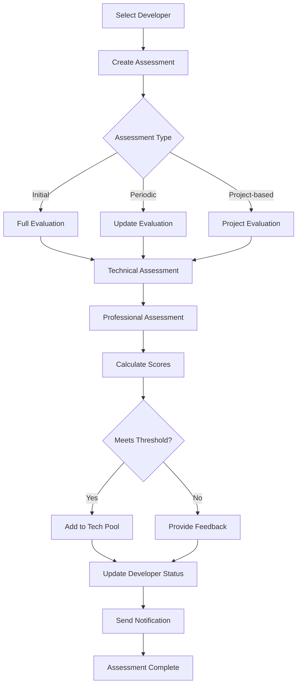

# Developer Evaluation System Implementation Guide

## Executive Summary
This guide provides comprehensive instructions for repurposing the existing Talent Tracker standalone app into a fully integrated Developer Evaluation System within the Andishi admin dashboard. The new system will enable administrators to evaluate developers for the Andishi tech talent pool, manage assessments, and update developer availability status.

## Table of Contents
1. [Current System Analysis](#current-system-analysis)
2. [Proposed Assessment Data Model](#proposed-assessment-data-model)
3. [Implementation Architecture](#implementation-architecture)
4. [Database Schema Updates](#database-schema-updates)
5. [API Endpoints](#api-endpoints)
6. [UI Components](#ui-components)
7. [Integration Steps](#integration-steps)
8. [Testing & Deployment](#testing--deployment)

---

## Current System Analysis

### Existing Developer Profile Structure

#### Database Models (Prisma Schema)
```typescript
// Current DeveloperProfile model includes:
- personalInfo: JSON (name, email, phone, location, linkedIn, github, portfolio)
- professionalInfo: JSON (title, experienceLevel, yearsExperience, bio, hourlyRate, availability)
- technicalSkills: JSON (languages, frameworks, tools, specializations, certifications)
- stats: JSON (projectsCompleted, totalEarnings, successRate, responseTime, rating)
- projects: JSON[] (project history and details)
- status: String (active, pending, suspended)
- availability: String (available, busy, on_leave)
- busyUntilDate: DateTime?
```

#### TypeScript Interfaces
```typescript
interface DeveloperProfile {
  id: string;
  userId: string;
  data: {
    personalInfo: PersonalInfo;
    professionalInfo: ProfessionalInfo;
    technicalSkills: TechnicalSkills;
    stats: Stats;
    projects: Project[];
  };
  status: 'active' | 'pending' | 'suspended';
  availability: 'available' | 'busy' | 'on_leave';
  busyUntilDate?: Date;
  lastActive: Date;
  createdAt: Date;
  updatedAt: Date;
}
```

### Talent Tracker App Analysis

#### Current Features
- **Resume Upload**: PDF upload and processing
- **AI Evaluation**: Automated feedback generation using AI
- **Scoring System**: Overall score with category breakdowns
- **Visual Display**: Resume preview with evaluation metrics
- **Key-Value Storage**: Uses Puter KV store for data persistence

#### Components Structure
```
talent-tracker/
├── routes/
│   ├── home.tsx        # Main listing page
│   ├── upload.tsx      # Profile upload & evaluation
│   ├── resume.tsx      # Individual evaluation view
│   └── auth.tsx        # Authentication
├── components/
│   ├── ResumeCard.tsx  # Profile card display
│   ├── ScoreCircle.tsx # Score visualization
│   ├── FeedbackTabs.tsx # Evaluation feedback tabs
│   └── FileUploader.tsx # File upload component
```

---

## Proposed Assessment Data Model

### DeveloperAssessment Model
```typescript
interface DeveloperAssessment {
  id: string;
  developerId: string;
  evaluatorId: string;
  evaluationType: 'initial' | 'periodic' | 'project_based';
  
  // Technical Assessment
  technicalSkills: {
    specialty: string; // e.g., "Frontend", "Backend", "Full Stack"
    primaryStack: string[]; // e.g., ["React", "Node.js", "MongoDB"]
    skillRatings: {
      category: string;
      rating: number; // 1-10
      notes?: string;
    }[];
    overallTechnicalScore: number; // 0-100
  };
  
  // Professional Assessment
  professionalSkills: {
    communication: number; // 1-10
    teamwork: number; // 1-10
    problemSolving: number; // 1-10
    timeManagement: number; // 1-10
    clientInteraction: number; // 1-10
    overallProfessionalScore: number; // 0-100
  };
  
  // Experience Assessment
  experienceAssessment: {
    relevantExperience: boolean;
    projectComplexity: 'junior' | 'mid' | 'senior' | 'lead';
    industryKnowledge: string[];
    portfolioQuality: number; // 1-10
  };
  
  // Final Evaluation
  evaluation: {
    overallScore: number; // 0-100
    recommendation: 'approved' | 'rejected' | 'needs_review' | 'probation';
    techPoolEligible: boolean;
    suggestedRate: number; // hourly rate
    suggestedProjects: string[]; // project types suitable for developer
    strengths: string[];
    improvements: string[];
    evaluatorComments: string;
  };
  
  // Metadata
  status: 'draft' | 'submitted' | 'reviewed' | 'finalized';
  createdAt: Date;
  updatedAt: Date;
  reviewedAt?: Date;
  expiresAt?: Date; // Assessment validity period
}
```

### Assessment Criteria by Developer Title

#### Frontend Developer
- **Technical Focus**: React/Vue/Angular, CSS/Tailwind, Responsive Design
- **Key Metrics**: UI/UX understanding, Component architecture, Performance optimization
- **Min Score for Pool**: 75/100

#### Backend Developer
- **Technical Focus**: Node.js/Python/Java, API Design, Database Management
- **Key Metrics**: System design, Security practices, Scalability understanding
- **Min Score for Pool**: 75/100

#### Full Stack Developer
- **Technical Focus**: End-to-end development, DevOps basics, Cloud services
- **Key Metrics**: Versatility, Integration skills, Full project lifecycle
- **Min Score for Pool**: 80/100

#### Mobile Developer
- **Technical Focus**: React Native/Flutter/Native, App optimization, Platform guidelines
- **Key Metrics**: Cross-platform skills, Performance tuning, App store knowledge
- **Min Score for Pool**: 75/100

---

## Implementation Architecture

### System Components

```
┌─────────────────────────────────────────────────────────┐
│                   Admin Dashboard                        │
├─────────────────────────────────────────────────────────┤
│                                                          │
│  ┌──────────────┐  ┌──────────────┐  ┌──────────────┐ │
│  │  Developer   │  │  Assessment  │  │  Evaluation  │ │
│  │   Profiles   │  │     Tab      │  │   Reports    │ │
│  └──────────────┘  └──────────────┘  └──────────────┘ │
│          │                 │                  │         │
├──────────┴─────────────────┴──────────────────┴─────────┤
│                    API Layer                             │
│  ┌────────────────────────────────────────────────────┐ │
│  │  /api/assessments  │  /api/evaluations  │  /api/   │ │
│  │                    │                     │  reports │ │
│  └────────────────────────────────────────────────────┘ │
├─────────────────────────────────────────────────────────┤
│                  MongoDB Database                        │
│  ┌────────────────────────────────────────────────────┐ │
│  │ Users │ DeveloperProfiles │ Assessments │ Projects │ │
│  └────────────────────────────────────────────────────┘ │
└─────────────────────────────────────────────────────────┘
```

### Data Flow
1. **Profile Selection**: Admin selects developer profile for evaluation
2. **Assessment Creation**: System creates new assessment record
3. **Evaluation Process**: Admin fills evaluation form with criteria
4. **Score Calculation**: System calculates scores based on weights
5. **Status Update**: Developer status and availability updated
6. **Pool Addition**: Qualified developers added to tech talent pool

---

## Database Schema Updates

### Prisma Schema Additions

```prisma
model DeveloperAssessment {
  id                String   @id @default(auto()) @map("_id") @db.ObjectId
  developerId       String   @db.ObjectId
  developer         DeveloperProfile @relation(fields: [developerId], references: [id])
  evaluatorId       String   @db.ObjectId
  evaluator         User     @relation(fields: [evaluatorId], references: [id])
  
  evaluationType    String   // initial, periodic, project_based
  technicalSkills   Json
  professionalSkills Json
  experienceAssessment Json
  evaluation        Json
  
  status            String   @default("draft") // draft, submitted, reviewed, finalized
  createdAt         DateTime @default(now())
  updatedAt         DateTime @updatedAt
  reviewedAt        DateTime?
  expiresAt         DateTime?
  
  @@index([developerId])
  @@index([evaluatorId])
  @@index([status])
}

// Update DeveloperProfile model
model DeveloperProfile {
  // ... existing fields ...
  
  assessments       DeveloperAssessment[]
  techPoolMember    Boolean  @default(false)
  poolJoinedDate    DateTime?
  lastAssessmentDate DateTime?
  assessmentScore   Float?
  
  @@index([techPoolMember])
}
```

---

## API Endpoints

### Assessment Management

#### POST /api/assessments
Create new assessment for a developer
```typescript
interface CreateAssessmentRequest {
  developerId: string;
  evaluationType: 'initial' | 'periodic' | 'project_based';
  technicalSkills?: Partial<TechnicalAssessment>;
  professionalSkills?: Partial<ProfessionalAssessment>;
}

interface CreateAssessmentResponse {
  assessment: DeveloperAssessment;
  message: string;
}
```

#### GET /api/assessments/:developerId
Get all assessments for a developer
```typescript
interface GetAssessmentsResponse {
  assessments: DeveloperAssessment[];
  currentScore?: number;
  poolStatus?: boolean;
}
```

#### PUT /api/assessments/:assessmentId
Update assessment (save draft or submit)
```typescript
interface UpdateAssessmentRequest {
  technicalSkills?: TechnicalAssessment;
  professionalSkills?: ProfessionalAssessment;
  experienceAssessment?: ExperienceAssessment;
  evaluation?: Evaluation;
  status?: 'draft' | 'submitted' | 'reviewed' | 'finalized';
}
```

#### POST /api/assessments/:assessmentId/finalize
Finalize assessment and update developer status
```typescript
interface FinalizeAssessmentRequest {
  updateDeveloperStatus: boolean;
  addToTechPool?: boolean;
  suggestedRate?: number;
  comments?: string;
}

interface FinalizeAssessmentResponse {
  assessment: DeveloperAssessment;
  developerUpdated: boolean;
  poolStatus: boolean;
  message: string;
}
```

### Evaluation Sending

#### POST /api/evaluations/send
Send evaluation request to developer
```typescript
interface SendEvaluationRequest {
  developerId: string;
  evaluationType: string;
  message: string;
  deadline?: Date;
}
```

---

## UI Components

### New Components Required

#### 1. AssessmentDashboard.tsx
Main dashboard for assessment management
```typescript
const AssessmentDashboard = () => {
  // Features:
  // - List of pending assessments
  // - Quick stats (total assessed, pending, approved)
  // - Filter by status, date, evaluator
  // - Search functionality
};
```

#### 2. DeveloperEvaluationForm.tsx
Comprehensive evaluation form
```typescript
const DeveloperEvaluationForm = ({ developerId }) => {
  // Sections:
  // - Technical Skills Rating
  // - Professional Skills Rating
  // - Experience Assessment
  // - Final Recommendation
  // - Auto-save functionality
};
```

#### 3. AssessmentReportView.tsx
Detailed assessment report display
```typescript
const AssessmentReportView = ({ assessmentId }) => {
  // Display:
  // - Score visualizations
  // - Detailed feedback
  // - Historical comparisons
  // - Export functionality
};
```

#### 4. TechPoolManager.tsx
Manage tech talent pool members
```typescript
const TechPoolManager = () => {
  // Features:
  // - List of pool members
  // - Performance metrics
  // - Availability status
  // - Bulk actions
};
```

### Modified Components

#### DeveloperProfilesOverview.tsx
Add assessment actions and status indicators
```typescript
// Add to existing component:
- "Start Assessment" button
- Assessment score display
- Pool membership badge
- Last assessment date
```

---

## Integration Steps

### Phase 1: Database Setup (Day 1-2)
1. **Update Prisma Schema**
   ```bash
   # Add DeveloperAssessment model
   # Update DeveloperProfile model
   npx prisma db push
   ```

2. **Create Migration Scripts**
   ```javascript
   // scripts/migrate-assessments.js
   // Initialize assessment fields for existing developers
   ```

### Phase 2: API Development (Day 3-5)
1. **Create Assessment API Routes**
   ```
   app/api/assessments/
   ├── route.ts              # GET all, POST new
   ├── [developerId]/
   │   └── route.ts         # GET by developer
   ├── [assessmentId]/
   │   ├── route.ts         # GET, PUT, DELETE
   │   └── finalize/
   │       └── route.ts     # POST finalize
   ```

2. **Create Evaluation API Routes**
   ```
   app/api/evaluations/
   ├── send/
   │   └── route.ts         # Send evaluation
   ├── track/
   │   └── route.ts         # Track responses
   ```

### Phase 3: UI Components (Day 6-9)
1. **Create Assessment Tab**
   ```typescript
   // app/admin-dashboard/assessments/page.tsx
   import AssessmentDashboard from '@/components/AssessmentDashboard';
   
   export default function AssessmentsPage() {
     return <AssessmentDashboard />;
   }
   ```

2. **Integrate with Existing Dashboard**
   ```typescript
   // Update admin-dashboard navigation
   // Add assessment tab to menu
   // Add assessment badge indicators
   ```

### Phase 4: Talent Tracker Integration (Day 10-12)
1. **Repurpose Upload Flow**
   - Modify upload.tsx to create assessment instead of resume
   - Update to use MongoDB instead of KV store
   - Integrate with developer profiles

2. **Transform Resume View**
   - Convert resume.tsx to assessment view
   - Add evaluation form components
   - Include score calculations

### Phase 5: Testing & Refinement (Day 13-15)
1. **Unit Tests**
   ```javascript
   // tests/assessments.test.js
   - Test score calculations
   - Test status updates
   - Test pool eligibility
   ```

2. **Integration Tests**
   ```javascript
   // tests/integration/assessment-flow.test.js
   - Test complete assessment workflow
   - Test developer status updates
   - Test notification system
   ```

---

## Testing & Deployment

### Testing Checklist

#### Functional Testing
- [ ] Create new assessment
- [ ] Save draft assessment
- [ ] Submit assessment
- [ ] Finalize assessment
- [ ] Update developer status
- [ ] Add to tech pool
- [ ] Send evaluation request
- [ ] View assessment history
- [ ] Export assessment report
- [ ] Filter and search assessments

#### Integration Testing
- [ ] MongoDB connection and queries
- [ ] API endpoint responses
- [ ] Authentication and authorization
- [ ] Email notifications
- [ ] Real-time updates
- [ ] Data consistency

#### Performance Testing
- [ ] Load testing with 100+ assessments
- [ ] Concurrent user testing
- [ ] Database query optimization
- [ ] API response times

### Deployment Steps

1. **Environment Variables**
   ```env
   # Add to .env.local
   ASSESSMENT_EXPIRY_DAYS=90
   MIN_POOL_SCORE=75
   ENABLE_AUTO_POOL_ADDITION=true
   ```

2. **Database Migration**
   ```bash
   # Production migration
   npx prisma migrate deploy
   npm run migrate:assessments
   ```

3. **Feature Flags**
   ```typescript
   // config/features.ts
   export const features = {
     assessmentSystem: process.env.ENABLE_ASSESSMENTS === 'true',
     autoPoolAddition: process.env.ENABLE_AUTO_POOL === 'true',
   };
   ```

4. **Monitoring Setup**
   ```javascript
   // Monitor key metrics:
   - Assessment completion rate
   - Average assessment time
   - Pool acceptance rate
   - System errors
   ```

---

## Security Considerations

### Access Control
- Only admins can create/modify assessments
- Developers can view their own assessments
- Implement role-based permissions

### Data Protection
- Encrypt sensitive evaluation data
- Implement audit logging
- Regular backups of assessment data

### Compliance
- GDPR compliance for EU developers
- Data retention policies
- Right to deletion requests

---

## Maintenance & Support

### Regular Tasks
- **Weekly**: Review pending assessments
- **Monthly**: Generate pool performance reports
- **Quarterly**: Update assessment criteria
- **Yearly**: Archive old assessments

### Troubleshooting Guide
| Issue | Solution |
|-------|----------|
| Assessment not saving | Check MongoDB connection, validate schema |
| Scores not calculating | Verify calculation logic, check field mappings |
| Developer status not updating | Check finalization process, verify permissions |
| Pool addition failing | Validate score thresholds, check eligibility criteria |

---

## Appendix

### Sample Assessment Workflow


### API Response Examples

#### Successful Assessment Creation
```json
{
  "success": true,
  "assessment": {
    "id": "67890abc",
    "developerId": "12345def",
    "evaluatorId": "admin123",
    "evaluationType": "initial",
    "status": "draft",
    "createdAt": "2024-01-15T10:00:00Z"
  },
  "message": "Assessment created successfully"
}
```

#### Assessment Finalization
```json
{
  "success": true,
  "assessment": {
    "id": "67890abc",
    "evaluation": {
      "overallScore": 82,
      "recommendation": "approved",
      "techPoolEligible": true
    },
    "status": "finalized"
  },
  "developerUpdated": true,
  "poolStatus": true,
  "message": "Developer successfully added to tech talent pool"
}
```

---

## Conclusion

This comprehensive guide provides all necessary information to successfully repurpose the Talent Tracker app into a robust Developer Evaluation System. The implementation follows best practices for scalability, security, and maintainability while leveraging existing infrastructure and components.

For questions or clarifications during implementation, refer to the relevant sections of this guide or consult the technical team.

---

## Implementation Status Update

### ✅ Completed Features (August 2025)

#### Database & Schema
- [x] **DeveloperAssessment Prisma Model**: Complete assessment data structure with technical skills, professional skills, experience assessment, and evaluation fields
- [x] **Database Relations**: Proper linking between DeveloperProfile, User, and DeveloperAssessment models

#### API Endpoints
- [x] **GET /api/assessments**: List assessments with filtering by developerId, status, evaluationType
- [x] **POST /api/assessments**: Create new assessment with validation and authorization
- [x] **GET /api/assessments/[assessmentId]**: Retrieve single assessment with developer details
- [x] **PUT /api/assessments/[assessmentId]**: Update assessment with score calculation and status management
- [x] **DELETE /api/assessments/[assessmentId]**: Remove assessment with proper cleanup
- [x] **POST /api/assessments/[assessmentId]/finalize**: Finalize assessment and update developer status/tech pool membership

#### Frontend Components
- [x] **AssessmentDashboard**: Complete dashboard with stats, filters, search, and assessment list with status badges
- [x] **DeveloperEvaluationForm**: Multi-tab evaluation form with technical, professional, experience, and final evaluation sections
- [x] **Assessment Integration**: Inline assessment views in DeveloperProfilesOverview (no redirects)
- [x] **Custom Toast System**: Replaced react-hot-toast with custom notification system for consistency

#### Hooks & Utilities
- [x] **useAssessments Hook**: Complete assessment management with CRUD operations, error handling, and state management
- [x] **Score Calculations**: Weighted scoring system for technical and professional skills
- [x] **Status Management**: Draft → Submitted → Reviewed → Finalized workflow

#### Authentication & Security
- [x] **JWT-based Auth**: Admin-only access to assessment APIs using jose library
- [x] **Role-based Access Control**: Only admins can create, modify, and finalize assessments
- [x] **Input Validation**: Comprehensive validation for all assessment data

### 🚧 Current Implementation Features

#### Assessment Email Workflow
**New Feature**: Automated assessment email sending after join-talent-pool form submission

**Workflow**:
1. Developer submits join-talent-pool form with resume and profile photo (required)
2. System automatically extracts developer email from form submission
3. Admin receives notification of new developer application
4. Admin can send assessment email directly from the assessments tab
5. Email includes assessment link and deadline information
6. Developer completes assessment and submits back to system
7. Admin reviews and finalizes assessment
8. Successful assessments automatically add developer to tech talent pool

**Implementation Requirements**:
- Email template for assessment invitations
- Assessment tracking and deadline management
- Resume and profile photo upload integration with Cloudinary
- Automated email extraction from join-talent-pool submissions

#### Resume & Profile Photo Requirements
**Enhancement**: Mandatory resume and profile photo upload for new developers

**Features**:
- Resume upload (PDF format) stored in Cloudinary - **REQUIRED**
- Profile photo upload (image formats) stored in Cloudinary - **REQUIRED**
- Integration with existing join-talent-pool form
- Validation to ensure both files are uploaded before form submission
- Existing developer profiles remain optional for backward compatibility

### 📋 Pending Implementation

#### TechPoolManager Component
- Advanced tech talent pool management interface
- Performance metrics and analytics
- Bulk operations for pool members
- Availability status management

#### Assessment Analytics
- Assessment completion rates
- Average scores by developer type
- Pool acceptance metrics
- Performance trending

### 🔧 Technical Implementation Notes

#### Toast Notification System
- **Issue**: Replaced react-hot-toast imports with custom useToast hook
- **Solution**: Consistent notification system across admin dashboard
- **Pattern**: `const { toast } = useToast(); toast.success(title, message);`

#### Authentication Pattern
- **Issue**: Inconsistent auth imports across API routes
- **Solution**: JWT verification using jose library with admin role checking
- **Pattern**: `verifyAdminAccess(request)` function for all assessment APIs

#### Inline Views Architecture
- **Design**: Assessment forms render inline within DeveloperProfilesOverview
- **Navigation**: Back button returns to profile list, no page redirects
- **State Management**: ViewMode includes "assess" state for seamless transitions

#### Error Handling
- **TypeScript**: Proper error type checking with `err instanceof Error`
- **API Responses**: Consistent error messages and status codes
- **UI Feedback**: Custom toast notifications for all user actions

### 🎯 Next Steps Priority

1. **High Priority**: Implement assessment email workflow with join-talent-pool integration
2. **High Priority**: Add resume/photo upload requirements to join-talent-pool form
3. **Medium Priority**: Create TechPoolManager component for advanced pool management
4. **Low Priority**: Add assessment analytics and reporting features

### 📧 Assessment Email Integration Specification

#### Email Templates Required
```typescript
interface AssessmentEmailTemplate {
  subject: string;
  htmlContent: string;
  textContent: string;
  assessmentLink: string;
  deadline: Date;
  developerName: string;
  evaluationType: 'initial' | 'periodic' | 'project_based';
}
```

#### API Endpoints for Email Workflow
- `POST /api/assessments/send-email`: Send assessment invitation email
- `GET /api/assessments/track/[emailId]`: Track email delivery and opens
- `POST /api/join-talent-pool`: Enhanced with email extraction and assessment triggering

#### Integration Points
- Join-talent-pool form submission triggers assessment email workflow
- Admin dashboard assessments tab includes "Send Assessment Email" action
- Email tracking and deadline management in assessment dashboard
- Automated follow-up reminders for pending assessments

**Document Version**: 2.0  
**Last Updated**: August 2025  
**Implementation Status**: Core Assessment System Complete, Email Workflow In Progress  
**Author**: Andishi Development Team
